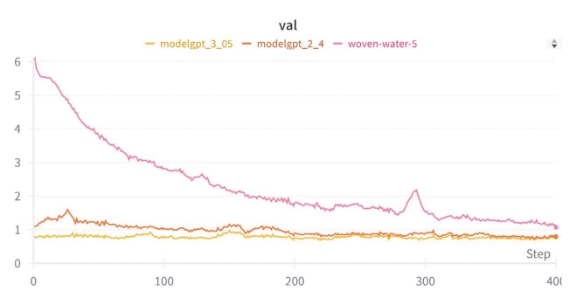
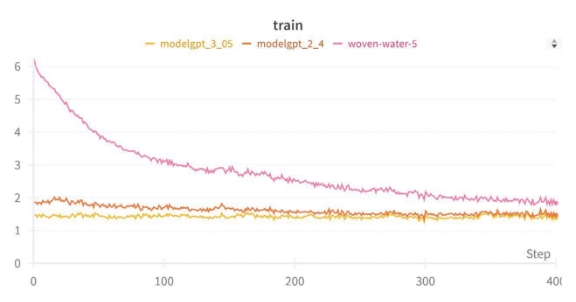

# **Assignment 5: Vector Quantized - VAE CSL7590: Deep Learning** 

**AY 2023-24, Semester II** 

**Alli Khadga Jyoth (M23CSA003)   Mohit Sharma (M23CSA015)** 

## Aim 

The primary aim of this assignment is to explore and implement VQVAE on the skin lesion dataset. Specifically, the aim can be broken down into two main objectives: 

1. **Train a Vector-Quantized Variational Autoencoder (VQ-VAE)** to efficiently encode and decode high-dimensional image data while capturing meaningful latent representations. 
1. **Train an Auto Regressive Model (ARM)** to generate new, realistic images based on the learned latent space representations from the VQ-VAE. 

## **Introduction**

The Vector-Quantized Variational Autoencoder (VQ-VAE) is a variant of the traditional Variational Autoencoder (VAE) that incorporates a Vector Quantization (VQ) mechanism to learn a discrete latent space representation. This discrete representation, coupled with a codebook, allows for efficient encoding and decoding of high-dimensional image data while capturing meaningful features in the latent space. 

In parallel, Auto Regressive Models (ARMs) have gained popularity for their ability to generate sequential data, such as images, by modeling the conditional probability distribution of each pixel given previous pixels.  

The primary objective of this assignment is to explore the effectiveness of combining VQ-VAE with a Transformer-based ARM for generating realistic skin lesion images. By training the VQ- VAE to learn a meaningful latent space representation of skin lesions and subsequently training an ARM to generate images based on this latent space, we aim to produce synthetic images that exhibit diversity, realism, and relevance to dermatological conditions. 
## **Methodology**
- Data Loading and Preprocessing 
- Data Augmentations  
1. Random horizontal flip – 0.4 
1. Random rotation - 10 
1. Center crop -128 
1. Tensor transformation 
1. Normalization using mean and std mean =  (0.6567, 0.3680, 0.3743) 

std =   (0.1701, 0.1709, 0.1831) data\_variance = 0.0487. 

### **Model Architecture:**

- Vector Quantizer Layer 
6. Implemented Vector Quantizer Layer: 
6. Utilized channel dimension for quantization space. 

viii. Flattened other dimensions to quantize using codebook vectors.

- Parameters: 
9. Batch Size: 256 
9. Number of Training Updates: 15000 
9. Num Hiddens: 64  
9. Num Residual Hiddens: 32 

xiii. Num Residual Layers: 2 

14. Embedding Dimension: 128 
14. Number of Embeddings: 512 
14. Commitment Cost: 0.25 

xvii. Decay: 0.99 (since we are using EMA Vector Quantizor as 

suggested in Paper). 

xviii.Learning Rate: 1e-3 

- Encoder & Decoder Architecture 

Based on ResNet framework. 

- Encoder: 
  - Three convolutional layers of residual hidden layers. 
  - Output layer as a residual stack. 
- Decoder: 
  - Single convolutional layer. 
  - Second layer as a residual stack. 
  - Two convolutional transpose layers for upscaling. 

## **Methodology: Task 2** 

### **Auto Regressive Model Used:  Transformer.** 

- Hyperparameters 
1. Batch Size: 128 (number of independent sequences processed in parallel) 
1. Block Size: 256 (maximum context length for predictions) 
1. Max Iterations: 600,000 
1. Evaluation Interval: Every 500 iterations 
1. Learning Rate: [0.0004, 0.0004 ,0.00005] (lr changed every 200000 iters) 
1. Evaluation Iterations: 200 
1. Embedding Dimension: 128 

viii. Number of Attention Heads: 6 

9. Number of Transformer Layers: 6 
9. Dropout Rate: 0.2 
9. Vocabulary Size: 512 + 2 (number of embeddings in the VQ-VAE with start + end tokens) 
9. Random Seed: 1337 
- Attention Mechanism 
- Multi-Head Attention: 

  xiii. Utilized in the Transformer-based model to capture dependencies across different 

positions in the input sequence. 

14. Allows the model to focus on different parts of the input sequence simultaneously, enhancing its ability to learn long-range dependencies. 
- GPT Regressive Model 
15. Integrated a GPT (Transformer) regressive model for generating diverse and realistic skin lesion images. 
15. Leveraged the power of the Transformer architecture in capturing contextual information and generating coherent sequences. 

xvii.Used for comparison and evaluation alongside the Transformer-based model to 

assess performance and effectiveness in generating high-quality images. 

## **Results:** 

**Sample image** 

**PSNR\_VALUE = 12.7** 

**VQ-VAE model (Reconstructed Image)** 

**Codebook Projection** 

**Autoregressive model Generations** 

**Transformer Training Metrics** 

##  **Analysis**

The analysis of the outcomes from both the Vector-Quantized Variational Autoencoder (VQ- VAE) and the Transformer based regressive model provides valuable insights into their effectiveness and capabilities for skin lesion image synthesis. 

- **VQ-VAE Performance:** 

  The VQ-VAE exhibited strong performance in generating reconstructed images that closely resembled the original skin lesion images. 

  It successfully preserved key features, contours, and details, showcasing its ability to encode and decode high-dimensional image data effectively. 

  The reconstructed images from the VQ-VAE were highly similar to the originals in terms of structure and overall appearance, indicating its suitability for precise image reconstruction and analysis in dermatological applications. 

- **GPT Regressive Model Challenges and Potential:** 

  The GPT regressive model in the Transformer architecture demonstrated potential in generating images with realistic color and texture. 

  However, it faced challenges in fully replicating the entire image structure and finer details present in the original images. 

  While the GPT model captured aspects like color and texture well, further optimization and fine-tuning are required to improve its ability to reconstruct images with higher fidelity and accuracy. 

##  **Conclusion**

In conclusion, the VQ-VAE emerged as a robust and effective model for skin lesion image synthesis, producing reconstructed images that closely mirrored the originals. Its ability to preserve intricate details and nuances makes it highly valuable for applications in dermatological analysis and computer-aided diagnosis. 

On the other hand, although the GPT regressive model showcased potential in capturing color and texture, it fell short in replicating the full image structure and finer details. Future work should focus on refining the GPT model parameters and training process to enhance image fidelity and accuracy. 
